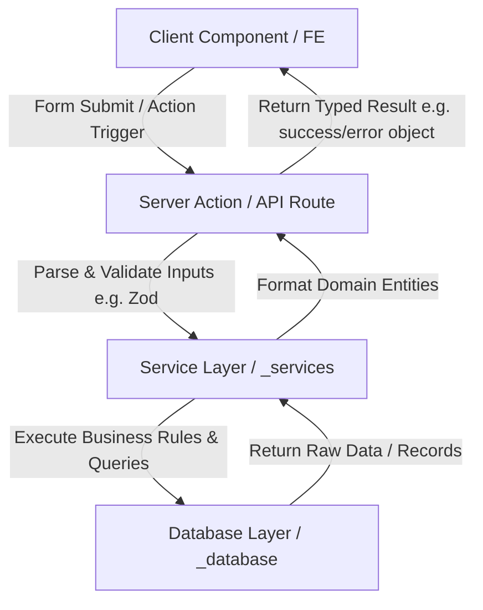

# Sakode Academy - Project Context & Fullstack Architecture Reference

Welcome! This document serves as the single source of truth for the **Sakode Academy** project. It outlines the project context, technical stack, and a strict architectural blueprint for both Frontend (FE) and Backend (BE) development. 

Any AI agent starting a new session in this workspace must read and adhere to this document to ensure consistent, clean, and modular code delivery.

---

## 1. Project Overview & Current Progress
**Sakode Academy** is a fullstack IT course learning portal designed for managing course registrations, trial classes, learning materials, and mentoring schedules.

* **Target Launch Date**: July 10, 2026 (`2026-07-10T00:00:00`)
* **Current Status**: 15% (Interactive welcome landing page, dynamic themes, and a production-ready 17-component Design System & UI Showcase page under `/ui-examples` are fully completed)
* **Subscribers File**: Emails registered via the newsletter are saved locally to `data/subscribers.json`

---

## 2. Core Features (Project Roadmap)
The application will consist of 5 core fullstack modules:
1. **Pendaftaran Siswa Baru (Student Registration)**: Registration pipeline for new IT students to sign up for classes.
2. **Pendaftaran Trial Gratis (Trial Registration)**: Booking system for free trial sessions to experience the platform.
3. **Modul Pembelajaran IT (Learning Modules)**: Access to structured IT curriculum modules, organized from basic to advanced standard industrial levels.
4. **Plotting & Profil Mentor (Mentor Management)**: Profiling system to view mentor credentials and handle allocation/plotting of mentors to students.
5. **Penjadwalan Mentoring Sesi (Mentor Scheduling)**: Calendar scheduling system for 1-on-1 private mentoring sessions with industry practitioners.

---

## 3. Technology Stack & Packages
* **Framework**: Next.js 16.2.9 (App Router with Turbopack)
* **Library**: React 19.2.4
* **Styling**: Tailwind CSS v4 (CSS-first engine)
* **Component Library**: HeroUI v3 (Compound components architecture, wcag-compliant React Aria)
* **Animations**: Framer Motion
* **Theming**: `next-themes` (Class-based toggle on the `<html>` tag)
* **Database Target**: Schema models are prepared for Drizzle ORM / Prisma. For initial staging, JSON/SQLite drivers can be colocated in `app/_database/`.

---

## 4. Fullstack Architectural Blueprint (FE & BE)
To keep the codebase maintainable and scalable as a single-repo fullstack project, we follow a **Feature-Based Colocation Architecture** using Next.js **Private Folders** (folders prefixed with an underscore `_`) and **Route Groups**. 

All Frontend UI, Backend Logic, Database Queries, and APIs associated with a specific route must be colocated inside that route's folder in `app/`. Shared code is placed in global private folders at the root `app/` level.

### Layered Architecture Structure:

```
app/
├── _actions/             <-- Shared Server Actions (BE)
├── _components/          <-- Shared UI components (FE)
├── _database/            <-- Database configuration & schemas (BE)
│   ├── db.ts             <-- DB Client (e.g. Prisma client, Drizzle db, or local JSON driver)
│   └── schema.ts         <-- DB Table / Schema definitions
├── _hooks/               <-- Shared custom React hooks (FE)
├── _services/            <-- Shared Business Logic & DB queries (BE Service Layer)
├── _types/               <-- Shared TS interfaces and types
├── _utils/               <-- Shared utility helper functions
│
├── (welcome)/            <-- Route group: welcome landing page
│   ├── _actions/         <-- Route-specific Server Actions (BE mutation)
│   │   └── subscribe.ts
│   ├── _components/      <-- Route-specific UI components (FE view)
│   │   └── WelcomePage.tsx
│   ├── _services/        <-- Route-specific business logic & validation (BE)
│   └── page.tsx          <-- Route Entry-point (renders _components/WelcomePage)
│
├── layout.tsx            <-- Root Layout (sets suppressHydrationWarning and Providers)
├── providers.tsx         <-- next-themes wrapper provider
└── globals.css           <-- Custom Tailwind theme variables and CSS overrides
```

### Request-Response Data Flow (Architecture Cycle):



### Architectural Layering Guidelines:

#### A. Frontend (FE) Layer
1. **Views & Components (`_components/`)**:
   * Keep components thin. They should focus on rendering UI and handling user interaction.
   * Put route-specific components inside the local route's `_components/` directory.
   * Reuse shared UI components from the root `app/_components/` directory.
2. **React Hooks (`_hooks/`)**:
   * Put all state-synchronization, API queries, or form validation hooks inside local or global `_hooks/` folders.

#### B. Backend (BE) Layer
To ensure separation of concerns, the backend is divided into three distinct layers:

1. **Mutation Layer (Next.js Server Actions - `_actions/`)**:
   * Located inside local route `_actions/` folders.
   * Actions must serve as simple controllers. They receive input parameters, check session/auth, call the **Service Layer** to do the work, and return a standardized result object.
   * Standard Result Object Format:
     ```typescript
     export type ActionResponse<T = any> = 
       | { success: true; data: T; message?: string }
       | { success: false; error: string; code?: string };
     ```
   * Actions must NOT contain raw database queries or complex business validation directly.
2. **REST API Layer (Next.js API Routes - `app/api/`)**:
   * Use REST endpoints inside `app/api/<feature>/route.ts` only for external webhooks, public APIs, or integrations.
   * Like Server Actions, API handlers must be thin and delegate all business logic to the **Service Layer**.
3. **Business Logic Layer (Services - `_services/`)**:
   * Located inside local route `_services/` or root `app/_services/`.
   * Services encapsulate core business rules, entity validations, and database interactions (Read/Write).
   * **Rule**: Both Server Actions and API Routes must reuse these service functions to guarantee logic consistency.
4. **Database/ORM Layer (`app/_database/`)**:
   * Database client connections and ORM schemas must reside in the private folder `app/_database/`.
   * Raw schemas and migration files are placed here.

---

## 5. Design Tokens & Branding
Branding values are derived from `/public/assets/Palette.svg` and configured inside `@theme` in `app/globals.css`.

### Theme Colors:
* `sakode-pink` (`#FF409F`)
* `sakode-orange` (`#F9723B`)
* `sakode-yellow` (`#EDAC1C`) - *Primary Gold Color representation.*
* `sakode-blue` (`#54A5E4`)
* `sakode-green` (`#009670`)
* `sakode-cyan` (`#71CFFE`)
* `sakode-charcoal` (`#383838`)

### Theme Configuration (next-themes):
* Light Mode (`:root`): `--background: #f9fafb` (zinc-50), `--foreground: #09090b` (zinc-950).
* Dark Mode (`.dark`): `--background: #030307` (deep dark), `--foreground: #f4f4f5` (zinc-100).
* Transitions: `body` background-color and text transition over `300ms` globally.

---

## 6. Guidelines for Future AI Agent Sessions
1. **Maintain File Colocation**: Keep components, hooks, actions, and services colocated inside route directories using private folder (`_components`, `_actions`, `_services`) conventions.
2. **Clean Server Actions**: Ensure Server Actions remain thin controllers that validate the request and call service functions. Keep database access isolated in the Service Layer.
3. **Follow Tailwind CSS v4 CSS-First Conventions**:
   * Do not use custom bracket classes if they can be written as modular variables (e.g. `h-150` instead of `h-[600px]`).
   * Use `bg-linear-to-r` instead of `bg-gradient-to-r`.
   * Use `translate-x-[-50%]` instead of `-translate-x-[50%]`.
4. **React 19 Event Typings**: Use `SyntheticEvent<HTMLFormElement>` for form events, as standard `FormEvent` is deprecated.
5. **Asynchronous Mounting**: When mounting client-side state, wrap triggers inside `requestAnimationFrame` to avoid linter warnings regarding synchronous state mutations in `useEffect`.
6. **No Emoji Overuse**: Emojis should not be used for primary SaaS visual components. Rely on professional numbers or clean typography instead.
7. **Consistent Action Responses**: Always return standard JSON objects with success/error/data structures from actions. Do not throw arbitrary exceptions to the client.
